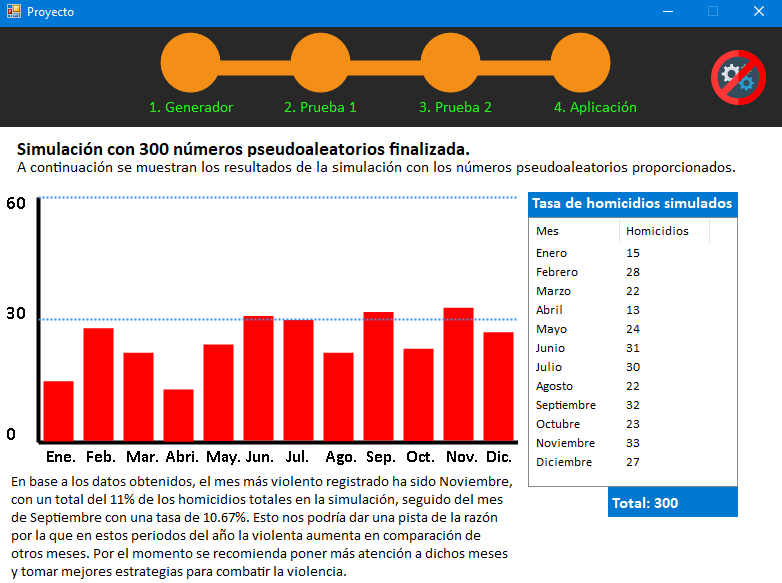

# **Simulador de homicidios dolosos en México** 

[Texto pendiente....]

[Texto pendiente....]

[Texto pendiente....]

 
 
 

> Pantalla de inicio del simulador.

 
 
 

> Pantalla donde se muestra el generador de números pseudo aleatorios.

 
 
 

> Pantalla donde se muestra la primera prueba de validación de números pseudoaleatorios.

 
 
 

> Pantalla donde se muestra la segunda prueba de validación de números pseudoaleatorios.

 
 
 

> Pantalla donde se muestran los datos que serán utilizados para realizar la simulación.

 
 
 

> Pantalla donde se muestra los resultados de la simulación, se puede apreciar además una ligera conclusión obtenida en base a esta.   

